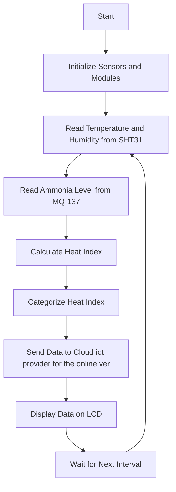

# Environmental Monitoring System

## Overview
This project involves developing an IoT-based environmental monitoring system using the ESP32 microcontroller, SHT31 sensor, MQ-137 ammonia sensor, and a MAX485 module for RS-485 communication. The data collected from the sensors is displayed on an I2C LCD and can be sent to the Blynk app for remote monitoring. The system also calculates the heat index and categorizes it into different levels.

## Table of Contents
1. [Project Structure](#project-structure)
2. [Components](#components)
3. [Code Structure](#code-structure)
4. [Heat Index Calculation](#heat-index-calculation)
5. [Flowchart](#flowchart)
6. [Setup Instructions](#setup-instructions)
7. [Usage](#usage)
8. [Future Enhancements](#future-enhancements)

## Project Structure
The project is structured as follows:
- `main_offline.ino`: The main Arduino sketch for the offline version.
- `main_adafruit.ino`: The main Arduino sketch with Adafruit IO integration.
- `main_blynk.ino`: The main Arduino sketch with Blynk integration.
- `flowchart`: The flowchart illustrating the process flow of the project.

## Components
- **ESP32 Microcontroller**: The main controller for the project.
- **SHT31 Sensor**: For measuring temperature and humidity.
- **MQ-137 Sensor**: For measuring ammonia concentration.
- **I2C LCD (20x4)**: For displaying sensor data locally.
- **Blynk App**: For remote monitoring of the sensor data.

## Code Structure
The main code is divided into the following sections:

1. **Libraries and Definitions**:
   - Includes necessary libraries and defines pins for sensors and modules.

2. **Sensor Initialization**:
   - Initializes the SHT31 and MQ-137 sensors.

3. **Data Collection and Calculation**:
   - Reads sensor data, calculates the heat index, and categorizes it.

4. **Data Transmission and Display**:
   - Depending on the version, sends the data to Adafruit IO or Blynk, displays it on the LCD, and transmits it over the RS-485 network.

## Heat Index Calculation
The heat index (H.I.) is calculated using the following formula:
\[ \text{H.I.} = \left(1.8 \times \text{Temperature} \, ^\circ\text{C} + \text{RH%} + 32\right) \times 1.8 \]

The heat index is then categorized into different levels based on its value:
- **Normal**: \(145 \leq \text{H.I.} \leq 149\)
- **Ideal**: \(150 \leq \text{H.I.} \leq 155\)
- **Tolerable**: \(156 \leq \text{H.I.} \leq 160\)
- **Extreme**: \(\text{H.I.} > 160\)

## Flowchart

## Setup Instructions
1. **Hardware Connections**:
   - Connect the SHT31 sensor to the I2C pins of the ESP32.
   - Connect the MQ-137 sensor to an analog input pin of the ESP32.
   - Connect the MAX485 module as follows:
     - DE and RE pins to a GPIO pin (e.g., GPIO4).
     - DI and RO pins to UART TX and RX pins (e.g., TX to GPIO17, RX to GPIO16).
     - A and B pins to the RS-485 network lines.
   - Connect the I2C LCD to the I2C pins of the ESP32.

2. **Software Setup**:
   - For the **offline version**:
     - [readme](code/offline/readme.md)
     - Open the `offline.ino` file in the Arduino IDE.
   - For the **Adafruit IO version**:
     - [readme](code/online/adafruit/readme.md)
     - Install the Adafruit IO and related libraries in the Arduino IDE.
     - Open the `adafruit.ino` file in the Arduino IDE.
     - Replace `"YOUR_AIO_KEY"` and other placeholders with your actual Adafruit IO key and credentials.
   - For the **Arduino IoT version**:
     - [readme](code/online/arduino_iot/readme.md)
     - Install the Blynk library in the Arduino IDE.
     - Open the `arduino_iot.ino` file in the Arduino IDE.
     - Replace `"your_SSID"`, `"your_PASSWORD"`, `"your_device_login_name"`, and `"your_device_key"` with your actual arduino iot cloud token (device name and key) and Wi-Fi credentials.
   - For the **Blynk version**:
     - [readme](code/online/blynk/readme.md)
     - Install the Blynk library in the Arduino IDE.
     - Open the `blynk.ino` file in the Arduino IDE.
     - Replace `"YOUR_BLYNK_AUTH_TOKEN"`, `"YOUR_SSID"`, and `"YOUR_PASSWORD"` with your actual Blynk authentication token and Wi-Fi credentials.

3. **Uploading the Code**:
   - Connect the ESP32 to your computer via USB.
   - Select the appropriate board and port in the Arduino IDE.
   - Upload the code to the ESP32.

## Usage
- **Monitoring Data**:
  - For the **offline version**, data will be displayed on the I2C LCD.
  - For the **Adafruit IO version**, data will be sent to the Adafruit IO dashboard for remote monitoring.
  - For the **Blynk version**, data will be sent to the Blynk app for remote monitoring.
  - The data will also be transmitted over the RS-485 network.

- **Interpreting the Heat Index**:
  - The heat index value and its category will be displayed, helping you understand the environmental conditions.

## Future Enhancements
- **Additional Sensors**: Integrate more sensors for comprehensive environmental monitoring.
- **Alerts**: Set up alerts in the Blynk app or Adafruit IO for extreme heat index levels.
- **Data Logging**: Implement data logging to track environmental conditions over time.
- **Web Dashboard**: Create a web dashboard for monitoring and controlling the system remotely.

This README provides a comprehensive guide to understanding, setting up, and using the IoT Environmental Monitoring System with Blynk and RS-485 communication. For detailed code and further customization, refer to the respective `main.ino` files for each version.
