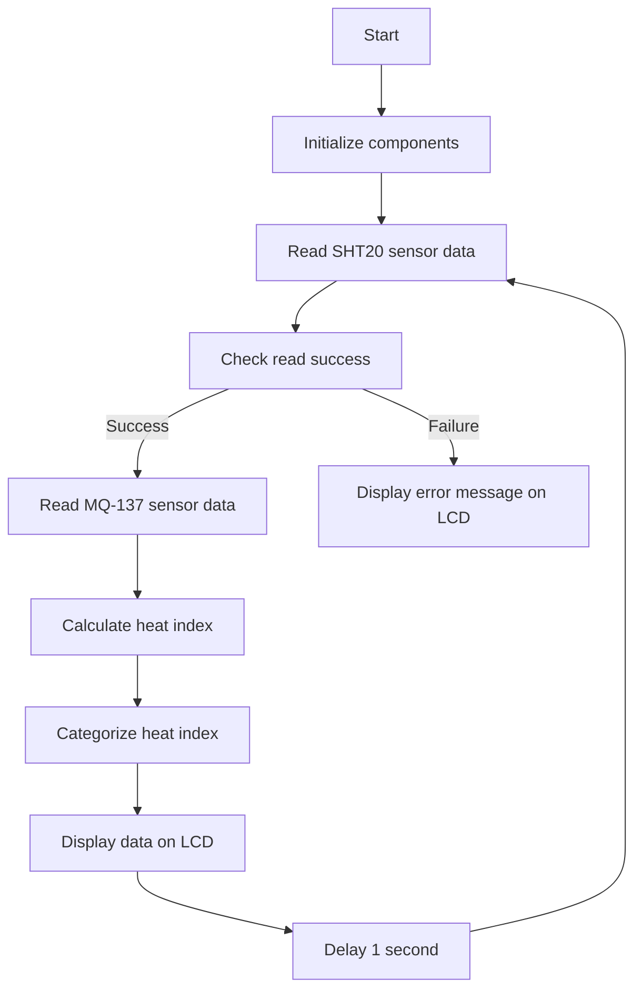

# Environmental Monitoring System

This project involves creating an environmental monitoring system using an SHT20 temperature and humidity sensor, an MQ-137 ammonia sensor, and an LCD display to show the readings.

## Structure

### Components

- **SHT20 Sensor**: Measures temperature and humidity.
- **MQ-137 Sensor**: Measures ammonia levels in the air.
- **LiquidCrystal_I2C**: LCD display for showing sensor data.

### Libraries

- `Wire.h`: For I2C communication.
- `LiquidCrystal_I2C.h`: For interfacing with the LCD.
- `SHT2x.h`: For reading data from the SHT20 sensor.

### Flowchart of the Code

## Explanation

### Initialization

1. **Serial Communication**: Initialize at 115200 baud rate.
2. **I2C Communication**: Initialize using `Wire.begin()`.
3. **SHT20 Sensor**: Initialize and check status.
4. **LCD**: Initialize and turn on the backlight.

### Functions

- **readMQ137()**: Reads the analog value from the MQ-137 sensor and converts it to ppm.
- **calculateHeatIndex(float temperature, float humidity)**: Converts temperature to Fahrenheit and calculates the heat index.
- **categorizeHeatIndex(float hi)**: Categorizes the heat index into safety levels.
- **displaySensorData()**: Reads sensor data, calculates heat index, and displays all values on the LCD.

### Main Program Flow

1. **Setup**: Initializes serial communication, I2C, sensors, and LCD.
2. **Loop**: Reads and displays sensor data every second.

## Use Case

### Example

- Monitor the temperature, humidity, and ammonia levels in a laboratory.
- Use the system in a greenhouse to ensure optimal growing conditions.
- Install the system in a kitchen to monitor air quality and potential ammonia leaks.

## Additional Information

### Calibration

Calibrate the MQ-137 sensor for accurate ppm readings. The conversion formula in the code is a simplified version and may need adjustments based on your specific setup and calibration data.

### Error Handling

If the SHT20 sensor fails to read, the system will display an error message on the LCD and print it to the serial monitor.

### Expansion

You can add more sensors or modules by expanding the I2C bus and updating the code accordingly.

### Requirements

#### Hardware

- Arduino board
- SHT20 sensor
- MQ-137 sensor
- LCD display with I2C interface
- Connecting wires

#### Software

- Arduino IDE
- Required libraries: `Wire.h`, `LiquidCrystal_I2C.h`, `SHT2x.h`

### Installation

1. **Connect the hardware components**: Follow the sensor and LCD pin configurations.
2. **Install the Arduino libraries**: Add the required libraries to your Arduino IDE.
3. **Upload the code**: Load the provided code onto your Arduino board.
4. **Monitor the output**: View the readings on the LCD and the serial monitor for debugging.

**figure:**

