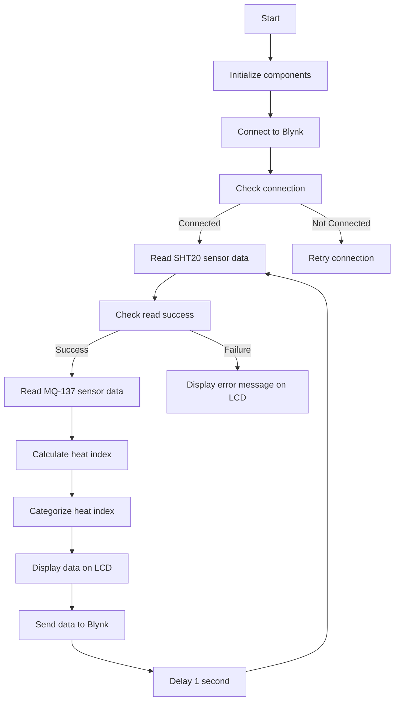

# Environmental Monitoring System with Blynk Integration

This project involves creating an environmental monitoring system using an SHT20 temperature and humidity sensor, an MQ-137 ammonia sensor, an LCD display, and Blynk for IoT integration.

## Structure

### Components

- **SHT20 Sensor**: Measures temperature and humidity.
- **MQ-137 Sensor**: Measures ammonia levels in the air.
- **LiquidCrystal_I2C**: LCD display for showing sensor data.
- **Blynk**: Connects the system to the Blynk IoT platform for data logging and remote monitoring.

### Libraries

- `Wire.h`: For I2C communication.
- `LiquidCrystal_I2C.h`: For interfacing with the LCD.
- `SHT2x.h`: For reading data from the SHT20 sensor.
- `BlynkSimpleEsp32.h`: For connecting to Blynk using an ESP32.
- `WiFi.h`: For WiFi connectivity.

### Flowchart of the Code

## Explanation

### Initialization

1. **Serial Communication**: Initialize at 115200 baud rate.
2. **I2C Communication**: Initialize using `Wire.begin()`.
3. **SHT20 Sensor**: Initialize and check status.
4. **LCD**: Initialize and turn on the backlight.
5. **Blynk**: Connect to Blynk using provided credentials and WiFi details.

### Functions

- **readMQ137()**: Reads the analog value from the MQ-137 sensor and converts it to ppm.
- **calculateHeatIndex(float temperature, float humidity)**: Converts temperature to Fahrenheit and calculates the heat index.
- **categorizeHeatIndex(float hi)**: Categorizes the heat index into safety levels.
- **displaySensorData()**: Reads sensor data, calculates heat index, displays all values on the LCD, and sends data to Blynk. Also prints data to the serial monitor.
- **setup()**: Initializes all components and connects to Blynk.
- **loop()**: Continuously reads and displays sensor data and sends data to Blynk at regular intervals.

### Main Program Flow

1. **Setup**: Initializes serial communication, I2C, sensors, LCD, and Blynk.
2. **Loop**: Reads and displays sensor data every second, and sends data to Blynk.

## Use Case

### Example

- Monitor the temperature, humidity, and ammonia levels in a laboratory, with remote data access via Blynk.
- Use the system in a greenhouse to ensure optimal growing conditions and remotely monitor the data.
- Install the system in a kitchen to monitor air quality and potential ammonia leaks, with IoT integration for alerts.

## Additional Information

### Calibration

Calibrate the MQ-137 sensor for accurate ppm readings. The conversion formula in the code is a simplified version and may need adjustments based on your specific setup and calibration data.

### Error Handling

If the SHT20 sensor fails to read, the system will display an error message on the LCD and print it to the serial monitor.

### Expansion

You can add more sensors or modules by expanding the I2C bus and updating the code accordingly. Additionally, more data feeds can be added to Blynk.

### Requirements

#### Hardware

- ESP32 board
- SHT20 sensor
- MQ-137 sensor
- LCD display with I2C interface
- WiFi module (if not built-in)
- Connecting wires

#### Software

- Arduino IDE
- Required libraries: `Wire.h`, `LiquidCrystal_I2C.h`, `SHT2x.h`, `BlynkSimpleEsp32.h`, `WiFi.h`
- Blynk account and credentials

### Installation

1. **Connect the hardware components**: Follow the sensor and LCD pin configurations.
2. **Install the Arduino libraries**: Add the required libraries to your Arduino IDE.
3. **Configure Blynk**: Replace placeholder credentials with your Blynk template ID, authentication token, and WiFi details.
4. **Upload the code**: Load the provided code onto your ESP32 board.
5. **Monitor the output**: View the readings on the LCD and the serial monitor for debugging, and check data logs on Blynk.

**figure:**

